# TodoClient

This project was generated using [Angular CLI](https://github.com/angular/angular-cli) version 20.0.0.

## Development server

To start a local development server, run:

```bash
ng serve
```

Once the server is running, open your browser and navigate to `http://localhost:4200/`. The application will automatically reload whenever you modify any of the source files.

## Code scaffolding

Angular CLI includes powerful code scaffolding tools. To generate a new component, run:

```bash
ng generate component component-name
```

For a complete list of available schematics (such as `components`, `directives`, or `pipes`), run:

```bash
ng generate --help
```

## Building

To build the project run:

```bash
ng build
```

This will compile your project and store the build artifacts in the `dist/` directory. By default, the production build optimizes your application for performance and speed.

## Running unit tests

To execute unit tests with the [Karma](https://karma-runner.github.io) test runner, use the following command:

```bash
ng test
```

## Running end-to-end tests

For end-to-end (e2e) testing, run:

```bash
ng e2e
```

Angular CLI does not come with an end-to-end testing framework by default. You can choose one that suits your needs.

## Used BackEnd Project
[https://github.com/DMGUK/todo-app-nest-js](https://github.com/DMGUK/todo-app-nest-js)


This Angular project works in conjunction with the NestJS backend project linked above. The Angular frontend handles user interaction and presentation logic, while the backend manages authentication, task data, and persistence.

## Interface Previews & Feature Descriptions

1. **Main todo list interface showing a list of tasks and controls like edit, delete, and status toggle.**
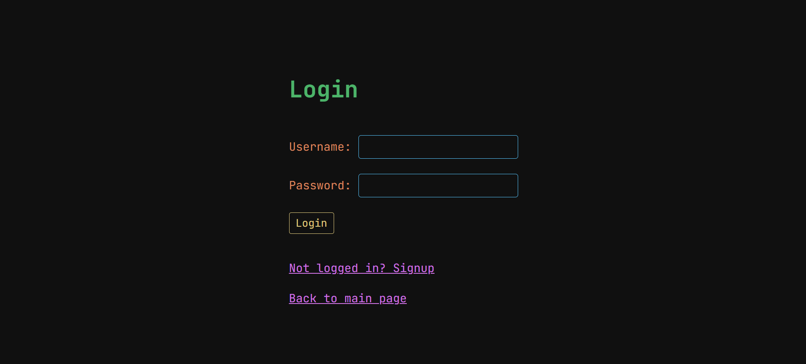
2. **A single task displayed with action buttons ("Mark as Finished", "Edit", "Delete").**
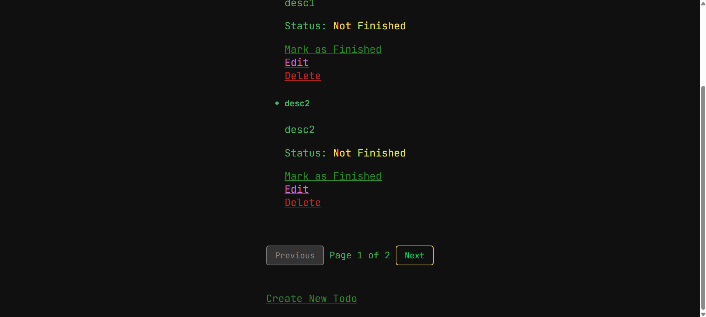 
3. **Pagination UI showing disabled "Previous" on the first page.**
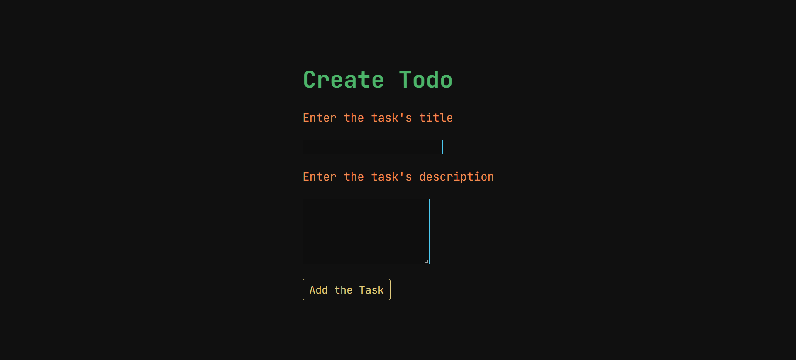
4. **Pagination UI showing spacing and structure ("Page 1 of 2") with both navigation buttons visible.** 
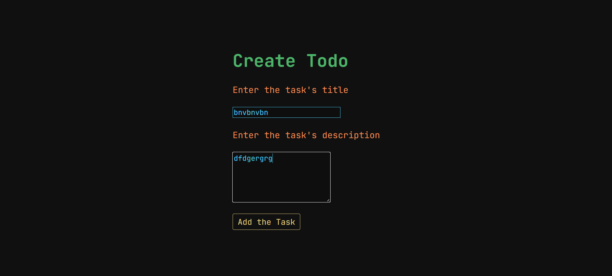
5. **Pagination UI when on page 1 of 1 — both "Previous" and "Next" are disabled with proper styling.**
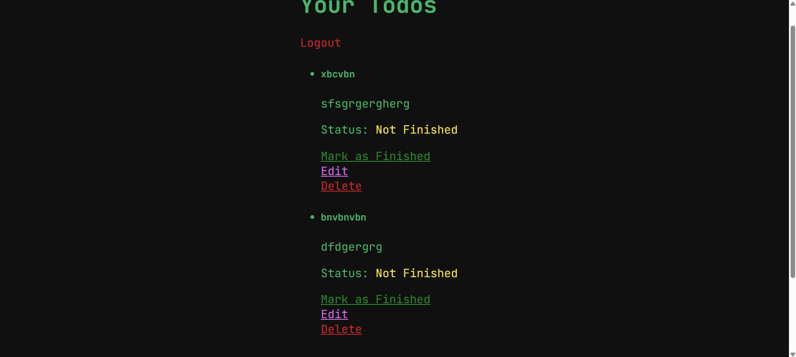
6. **Stylish login button showing the app’s design language (JetBrains Mono font, soft border).**
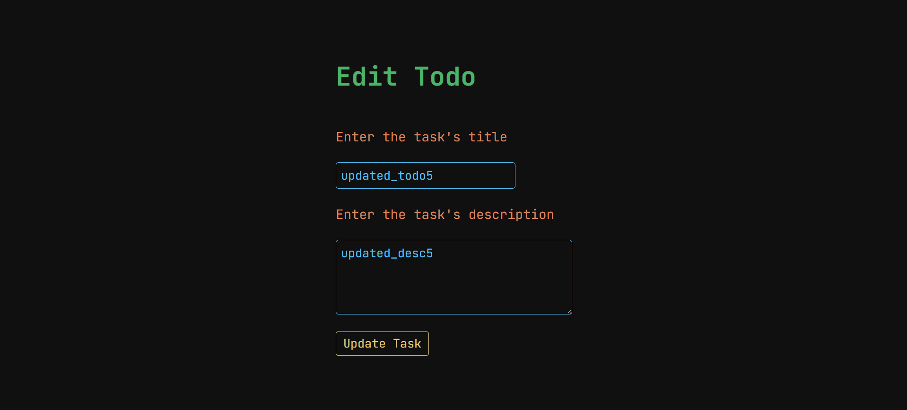
7. **Signup error message styled in red block, indicating validation feedback.** 
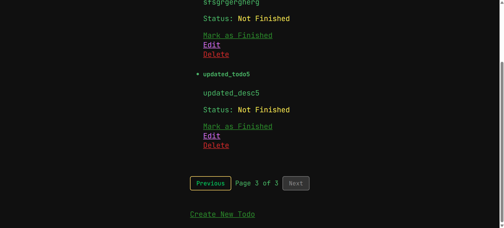
8. **Task update form before styling corrections.**
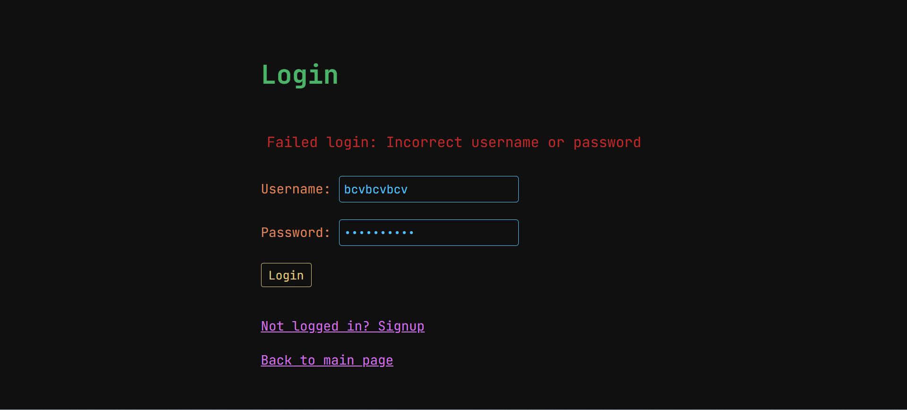
9. **Task creation form styled in modern minimalism — consistent font, spacing, and structure.**
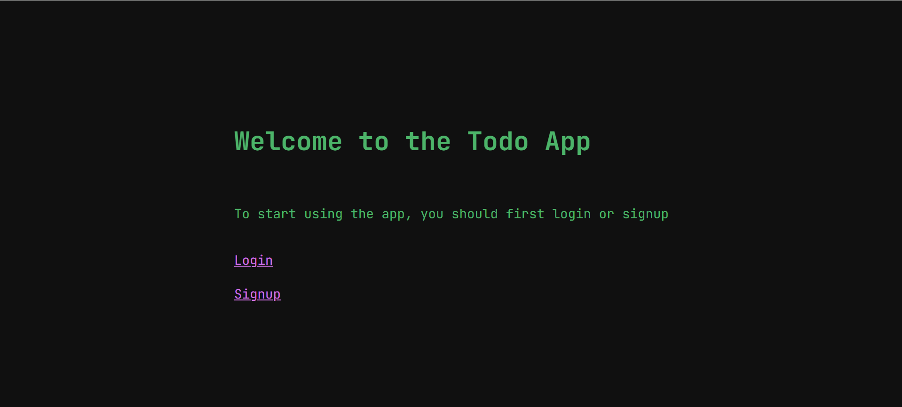
10. **Example of an updated pagination component styled with conditional disabling.**
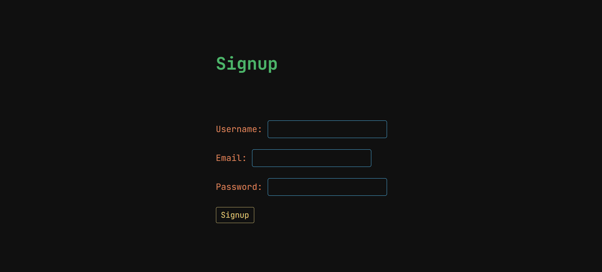
11. **Styled todo edit form resembling the design language of the creation form.**
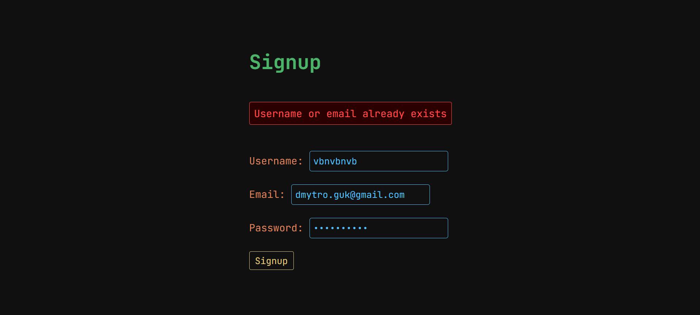
12. **Final version of the create form, now matching the "edit" form in design and layout.**
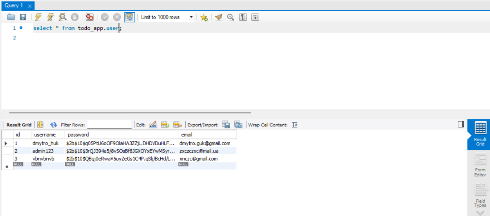

## Additional Resources

For more information on using the Angular CLI, including detailed command references, visit the [Angular CLI Overview and Command Reference](https://angular.dev/tools/cli) page.
